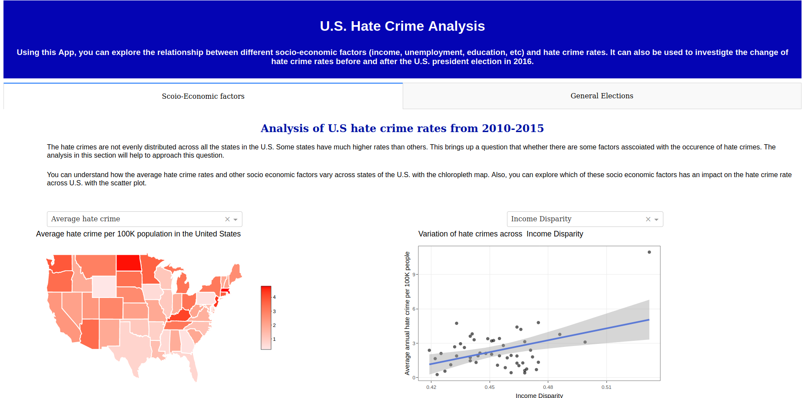
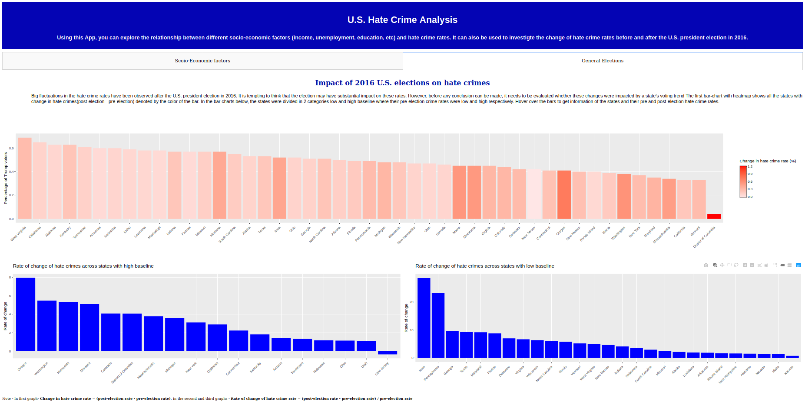
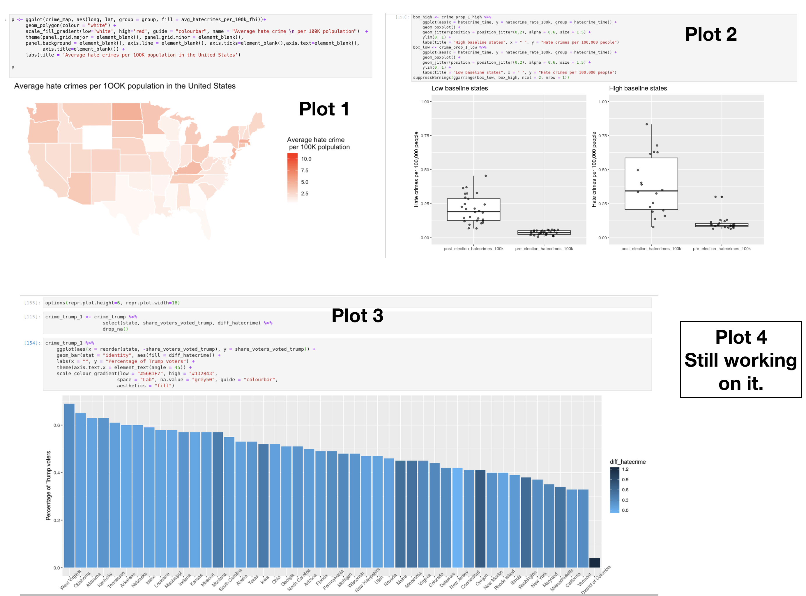

# DSCI_532_Group_103_L01 Dash App

## Team members 

* Saurav Chowdhury
* Sukriti Trehan
* Subing Cao

[Team Contract](https://github.ubc.ca/MDS-2019-20/DSCI_532_milestone1_saurav99/blob/master/Contract.md)

## Overview and Usage of the App

The U.S. Hate Crime Analyis application aims to explore the trend of hate crimes across the country and inspect changes in these rates post the 2016 presidential elections. The app has two tabs, with the first one focused on possible relationship between potential demographic factors and hate crime rates and the second one diving into analysis of change in hate crime rates with voting trends.

On the first tab, users can see a choropleth map for visualization of the average annual hate crime rate geospatially in the United States. Users can hover over each state to check the values of hate crime rate and and compare the rate of hate crime with other states. Further, a scatterplot shows the correlation between each potential factor and the hate crime rate with regression line. From a dropdown list, users can select the type of factor they want to comapre with the hate crime rate. Users can also use the tooltip to check the values for each point which represent a US state in the plot. 

To explore the change of hate crime rates and its plausible relation with the voting pattern of the state, the user can head over to the heatmap on the second tab of the dashboard. This graph details the share of voters in a state supporting one candidate and the extent of change in hate crime rate 10 days after election from the average pre election rate. To understand whether the state had a high or low crime rate before the election (baseline rate), there are two bar graphs segregating states based on high or low baseline hate crime rate. Users can click on the state’s bar in the heatmap to see which bar graph that state lies in and understand the rate of change of hate crime of the state post election.

Currently some static plots for this app has been made in R. Here is a summary of the plots and the R codes that has been done. Also the R script creation for dashboard has been initiated.

**Note** - *This app is build using Dash which supports Python and R.*
